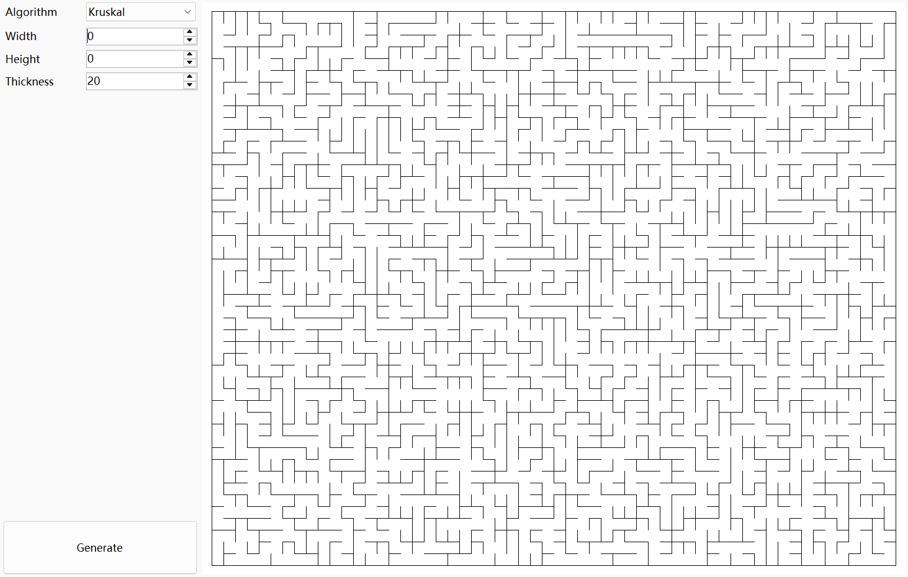
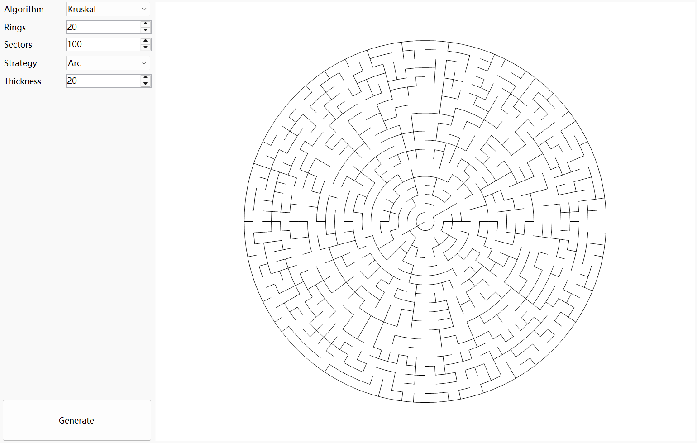

# 随机迷宫生成器

提供多种形状的随机迷宫生成器

- 矩形迷宫生成器
- 圆形迷宫生成器

每种形状都有多种算法

- DFS
- BFS
- Prim
- Kruskal
- Wilson
- Eller
- AldousBroder

## 矩形迷宫生成器

``` csharp
public class RectangularMazeGenerator
```

#### 同步函数

``` csharp
public RectangularMazeField Create(int width, int height, MazeAlgorithm algorithm = MazeAlgorithm.Prim)
```

#### 异步函数

``` csharp
public await Task<RectangularMazeField> CreateAsync(int width, int height, MazeAlgorithm algorithm = MazeAlgorithm.Prim)
```

#### 参数

- **width**  宽度
- **height** 高度
- **algorithm** 生成算法

### 示例

``` csharp
var generator = new RectangularMazeGenerator();
generator.Create(width, height, MazeAlgorithm.Kruskal);
```

### 效果



## 圆形迷宫生成器

``` csharp
public class CircularMazeGenerator
```

#### 同步函数

``` csharp
public CircularMazeField Create(int width, int height, MazeAlgorithm algorithm = MazeAlgorithm.Prim)
```

#### 异步函数

``` csharp
public await Task<CircularMazeField> CreateAsync(int width, int height, MazeAlgorithm algorithm = MazeAlgorithm.Prim)
```

#### 参数

- **width**  宽度
- **height** 高度
- **algorithm** 生成算法

### 示例

``` csharp
var generator = new CircularMazeGenerator();
generator.Create(width, height, MazeAlgorithm.Kruskal);
```

### 效果

