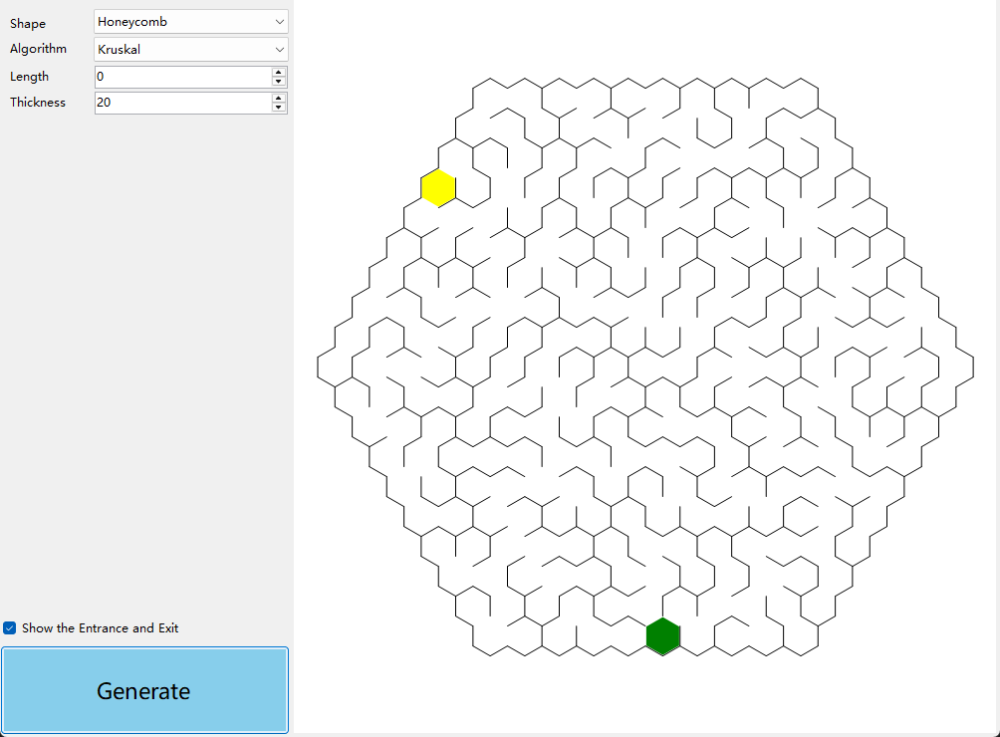
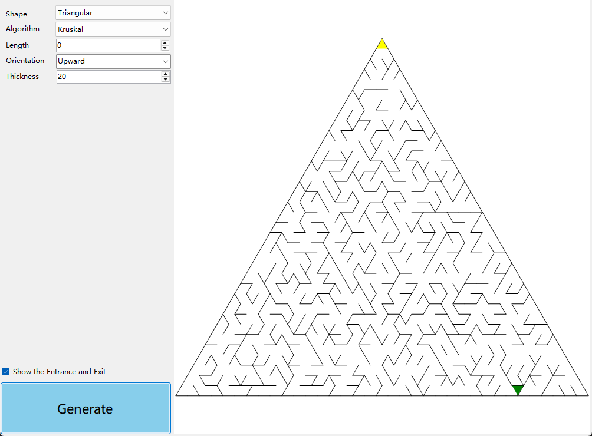
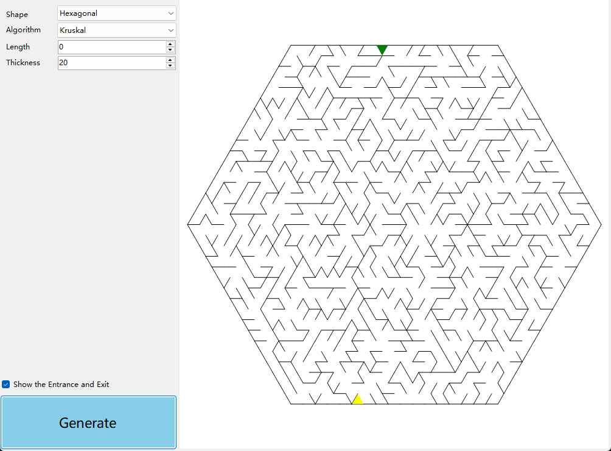

# 随机迷宫生成器

提供多种形状的随机迷宫生成器

- 矩形迷宫生成器
- 圆形迷宫生成器

每种形状都有多种算法

- DFS
- BFS
- Prim
- Kruskal
- Wilson
- Eller
- AldousBroder

## 矩形迷宫生成器

``` csharp
public class RectangularMazeGenerator
```

#### 同步函数

``` csharp
public RectangularMazeField Create(int width, int height, MazeAlgorithm algorithm = MazeAlgorithm.Prim)
```

#### 异步函数

``` csharp
public await Task<RectangularMazeField> CreateAsync(int width, int height, MazeAlgorithm algorithm = MazeAlgorithm.Prim)
```

#### 参数

- **width**  宽度
- **height** 高度
- **algorithm** 生成算法

### 示例

``` csharp
var generator = new RectangularMazeGenerator();
generator.Create(width, height, MazeAlgorithm.Kruskal);
```

### 效果


## 圆形迷宫生成器

``` csharp
public class CircularMazeGenerator
```

#### 同步函数

``` csharp
public CircularMazeField Create(int rings, 
                                int sectors, 
                                MazeAlgorithm algorithm = MazeAlgorithm.DFS, 
                                SectorStrategy strategy = SectorStrategy.Arc)
```

#### 异步函数

``` csharp
public async Task<CircularMazeField> CreateAsync(int rings, 
                                                 int sectors, 
                                                 MazeAlgorithm algorithm = MazeAlgorithm.DFS, 
                                                 SectorStrategy strategy = SectorStrategy.Arc)
```

#### 参数

- **rings** 环数
- **sectors** 最大分割数
- **algorithm** 生成算法
- **strategy** 分割策略

### 示例

``` csharp
var generator = new CircularMazeGenerator();
generator.Create(rings, sectors, MazeAlgorithm.Kruskal, SectorStrategy.Arc);
```

### 效果


## 蜂窝状迷宫生成器

``` csharp
public class HoneycombMazeGenerator
```

#### 同步函数

``` csharp
public HoneycombMazeField Create(int size, EMazeAlgorithm algorithm = EMazeAlgorithm.Prim)
```

#### 异步函数

``` csharp
public async Task<HoneycombMazeField> CreateAsync(int size, EMazeAlgorithm algorithm = EMazeAlgorithm.Prim)
```

#### 参数

- **size** 边长
- **algorithm** 生成算法

### 示例

``` csharp
var generator = new HoneycombMazeGenerator();
generator.Create(length, MazeAlgorithm.Kruskal);
```

### 效果



## 三角形迷宫生成器

``` csharp
public class TriangularMazeGenerator
```

#### 同步函数

``` csharp
public TriangularMazeField Create(int order,
                                  TriangleOrientation orientation = TriangleOrientation.Upward,
                                  EMazeAlgorithm algorithm = EMazeAlgorithm.Prim)
```

#### 异步函数

``` csharp
public async Task<TriangularMazeField> CreateAsync(int order,
                                                   TriangleOrientation orientation = TriangleOrientation.Upward,
                                                   EMazeAlgorithm algorithm = EMazeAlgorithm.Prim)
```

#### 参数

- **order** 边长
- **orientation** 朝向
    - Upward 朝上
    - Downward 朝下
- **algorithm** 生成算法

### 示例

``` csharp
var generator = new TriangularMazeGenerator();
generator.Create(length, orientation, MazeAlgorithm.Kruskal);
```

### 效果



## 六边形迷宫生成器

``` csharp
public class HexagonalMazeGenerator
```

#### 同步函数

``` csharp
public HexagonalMazeField Create(int size, EMazeAlgorithm algorithm = EMazeAlgorithm.Prim)
```

#### 异步函数

``` csharp
public async Task<HexagonalMazeField> CreateAsync(int size, EMazeAlgorithm algorithm = EMazeAlgorithm.Prim)
```

#### 参数

- **size** 边长
- **algorithm** 生成算法

### 示例

``` csharp
var generator = new HexagonalMazeGenerator();
generator.Create(length, MazeAlgorithm.Kruskal);
```

### 效果



## 圆环-三角格迷宫生成器

``` csharp
public class HexagonalMazeGenerator
```

#### 同步函数

``` csharp
public HexagonalMazeField Create(int size, EMazeAlgorithm algorithm = EMazeAlgorithm.Prim)
```

#### 异步函数

``` csharp
public async Task<HexagonalMazeField> CreateAsync(int size, EMazeAlgorithm algorithm = EMazeAlgorithm.Prim)
```

#### 参数

- **size** 边长
- **algorithm** 生成算法

### 示例

``` csharp
var generator = new HexagonalMazeGenerator();
generator.Create(length, MazeAlgorithm.Kruskal);
```

### 效果

