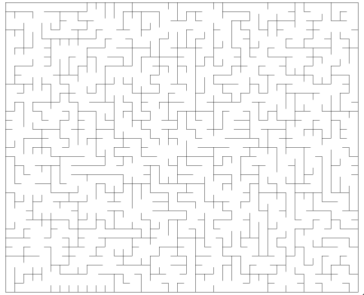

# 随机迷宫生成器

## 矩形迷宫

``` csharp
public class RectangularMazeGenerator
```

#### 同步函数

``` csharp
public RectangularMazeField Create(int width, int height, RectangularMazeAlgorithm algorithm = RectangularMazeAlgorithm.Prim)
```

#### 异步函数

``` csharp
public await Task<RectangularMazeField> CreateAsync(int width, int height, RectangularMazeAlgorithm algorithm = RectangularMazeAlgorithm.Prim)
```

#### 参数

- **width**  宽度
- **height** 高度
- **algorithm** 生成算法，提供了三种生成矩形迷宫的算法
    - DFS
    - Prim
    - Kruskal

### 示例

``` csharp
var generator = new RectangularMazeGenerator();
generator.Create(width, height, RectangularMazeAlgorithm.Kruskal);
```

> 详细用法和示例请见 [测试工程](https://github.com/simplex86/Maze.Net-Test)

### 效果



## 圆形迷宫

``` csharp
public class CircularMazeGenerator
```