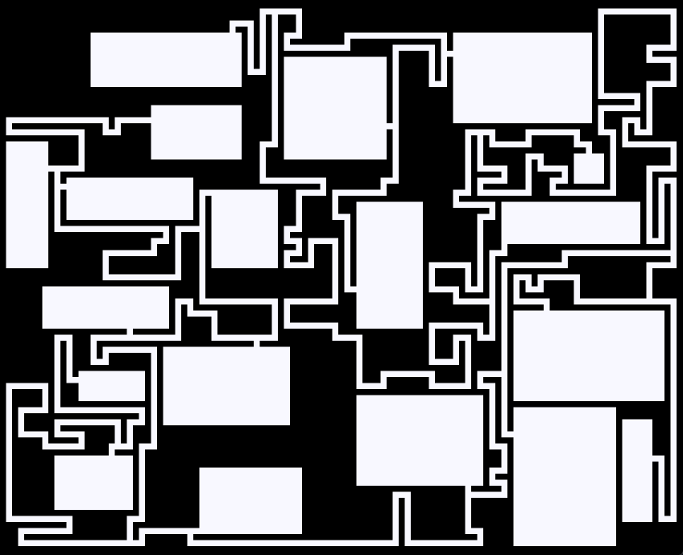

# 随机迷宫和地牢生成器

纯C#实现创建随机迷宫和地牢

## 迷宫

### 矩形迷宫

提供了三种生成矩形迷宫的算法

- DFS
- Prim
- Kruskal

``` csharp
var maze = new RectangleMaze();
maze.Create(width, height, RectangleMazeAlgorithm.Kruskal);
```


## 地牢

### 矩形地牢

提供了两种生成矩形地牢的算法

- Nystroms
- OverlapR

``` csharp
dungeon.CreateAsync(width,
                    height,
                    roomMinWidth,
                    roomMaxWidth,
                    roomMinHeight,
                    roomMaxHeight,
                    roomCount,
                    mulconnector,
                    tortuosity,
                    RectangleDungeonAlgorithm.Nystroms);
```


