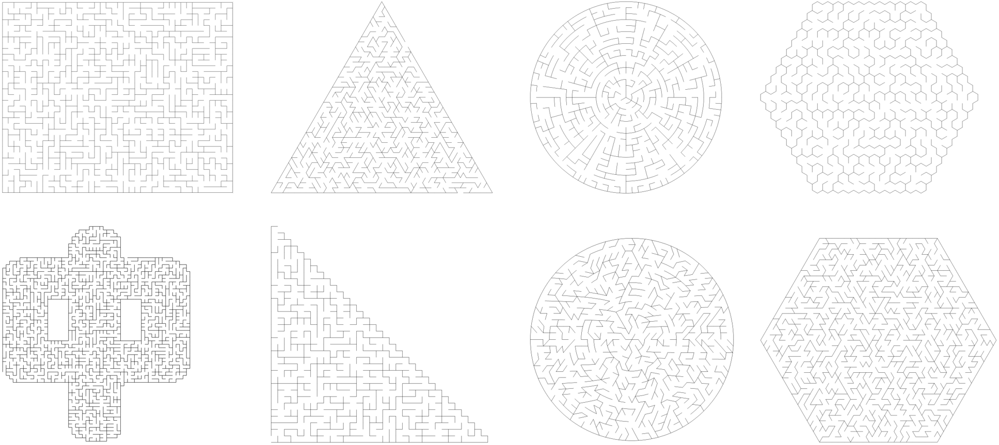
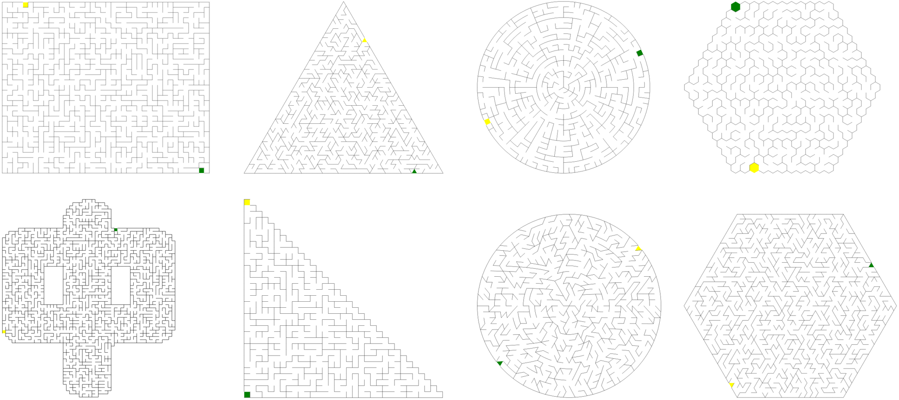
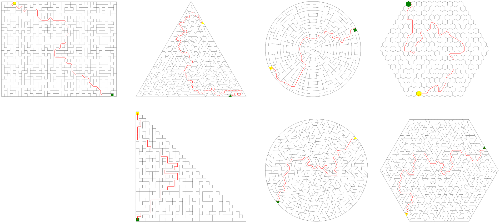

# 随机迷宫生成器

随机迷宫生成器包括四个模块

- [迷宫生成器](#迷宫生成器)
- [出入口生成器](#出入口生成器)
- [解法生成器](#解法生成器)
- [质量评估器](#质量评估器)

## 迷宫生成器



提供多种形状的迷宫场的数据结构

- [矩形](./doc/reference/retangular_maze.md)
- [圆形](./doc/reference/circular_maze.md)
- [蜂窝](./doc/reference/honeycomb_maze.md)
- [三角形](./doc/reference/triangular_maze.md)
- [六边形](./doc/reference/hexagonal_maze.md)
- [圆三角格](./doc/reference/circularhexagon_maze.md)
- [阶梯形](./doc/reference/stairway_maze.md)
- [自定义](./doc/reference/customized_maze.md)

由（统一的）随机迷宫生成器生成不同的迷宫

``` csharp
public class MazeGenerator
{
    // 同步函数
    public MazeField Generate(MazeField field, EMazeAlgorithm algorithm);
    // 异步函数
    public async Task<MazeField> GenerateAsync(MazeField field, EMazeAlgorithm algorithm)
}
```

### 参数

- **field** 迷宫场数据
- **algorithm** 生成算法
    - DFS
    - BFS
    - Prim
    - Kruskal
    - Wilson
    - Eller
    - Aldous-Broder
    - Hunt and Kill

> 每种形状都有多种算法
> 
> | 算法 | 迷宫风格 | 随机偏差 | 死胡同特征 | 速度 | 内存占用 | 稳定性 |
> |------|:-------:|:-------:|:---------:|:---:|:----:|:------:|
> | **DFS** | 长通道、少分支 | 强（方向偏好）| 少而深 | ⚡⚡快 | 低 | ✅ 稳> 定 |
> | **BFS** | 短通道、多分支 | 轻（径向偏好）| 多而浅 | ⚡⚡快 | 中 | ✅ 稳> 定 |
> | **Prim** | 珊瑚状生长 | 轻（扩散偏好）| 多而浅 | ⚡⚡快 | 较高 | ✅ 稳定 |
> | **Kruskal** | 均匀纹理 | 无 | 均匀 | ⚡⚡快 |	较高 | ✅ 稳定 |
> | **Wilson** | 完全随机 | 无（均匀）| 均匀 | 🐢不可预测 | 中 | ❌ 不稳定 |
> | **Eller** | 层状结构 | 强（水平偏好）| 中等 | ⚡⚡快 | 极低 | ✅ 稳定 |
> | **Aldous-Broder** | 完全随机 | 无（均匀）| 均匀 | 🐢🐢极慢 | 低 | ❌ 极> 不稳定 |
> | **Hunt and Kill** | 长通道+岛屿式分支 | 轻（索引偏好）| 中等，集中在跳跃> 点 | ⚡中等 | 极低 | ✅ 稳定 |
> 
> 各算法生成迷宫的特征及性能对比的详情，请看[这里](./doc/comparison/README.md)
> 
> 需要特别强调的是：Eller 算法是基于行扫描的，**不支持六边形和圆三角格**两种形状。当选择用 Eller 算法生成这两种形状的迷宫时，会退化为 DFS 算法。

### 示例

``` csharp
var field = new CircularMazeField(17, 100);
var field = generator.Generate(field, MazeAlgorithm.Kruskal);
```

## 出入口生成器



为各种形状的迷宫生成随机出入口

``` csharp
public class MazeGateGenerator
{
    // 创建迷宫出入口（同步）
    public MazeGate Generate(MazeField field);
    // 创建迷宫出入口（异步）
    public async Task<MazeGate> GenerateAsync(MazeField field)
}
```

> [!NOTE]  
> 无论哪种形状的迷宫，出入口都只会出现在处于迷宫边缘的格子上。但不同形状的迷宫又略微有一些差异
> | 迷宫形状 | 出入口位置 |
> |---------|-----------|
> | 矩形迷宫 | 矩形的对边 |
> | 圆形迷宫 | 同直径的两端 |
> | 蜂窝迷宫 | 蜂窝（六边形）的对边 |
> | 三角形迷宫 | 不同边 |
> | 六边形迷宫 | 六边形的对边 |
> | 圆三角格迷宫 | 同直径的两端 |
> | 阶梯形迷宫 | 入口在直角点，出口在顶点 |
> | 自定义迷宫 | 迷宫边缘 |

## 解法生成器



在各种形状的迷宫的出入口之间，计算出有效路径

``` csharp
public class MazeSolutionGenerator
{
    // 根据迷宫和出入口数据，计算迷宫解法
    public MazeSolution Generate(MazeField field, MazeGate gate);
}
```

### 示例

``` csharp
var generator = new MazeSolutionGenerator();
var solution = generator.Generate(field, gate);
```

## 质量评估器

根据迷宫、出入口、解法，评估迷宫的质量

``` csharp
public class MazeScoreEvaluator
{
    // 评估迷宫质量（同步）
    public static MazeScore Evaluate(MazeField field, MazeGate gate, MazeSolution solution);
    // 评估迷宫质量（异步）
    public static async Task<MazeScore> EvaluateAsync(MazeField field, MazeGate gate, MazeSolution solution)
}
```