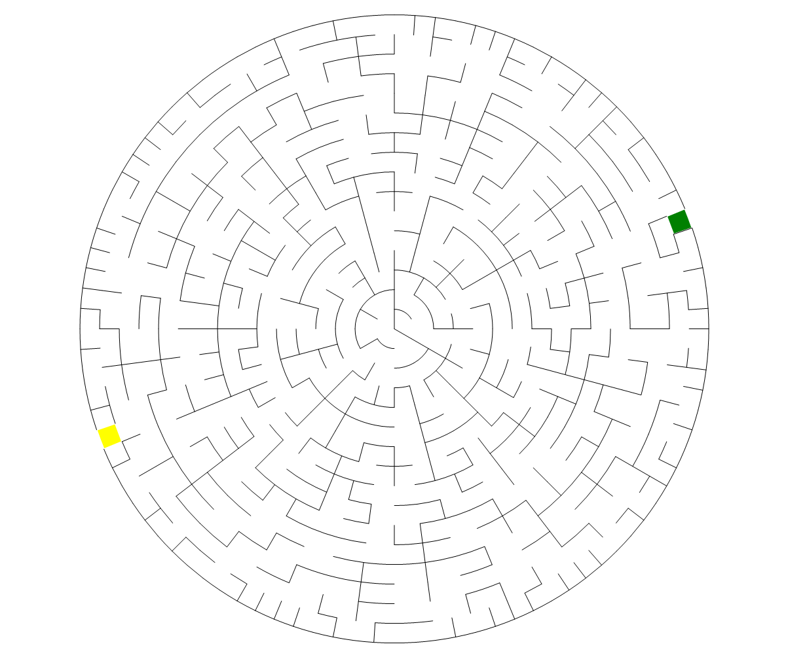

# 圆形迷宫出入口生成器

``` csharp
public class CircularMazeGateGenerator
{
    // 生成迷宫出入口
    public MazeGate Generate(CircularMazeField field);
}
```

## 参数

- **field** [圆形迷宫生成器](./circular_maze.md)创建的圆形迷宫数据

## 示例

``` csharp
var generator = new CircularMazeGateGenerator();
var gate = generator.Generate(field);
```

