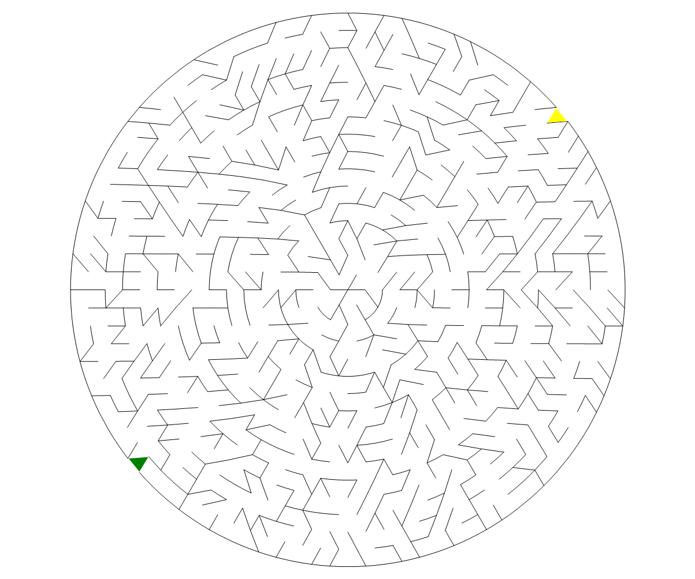

# 圆三角格迷宫出入口生成器

``` csharp
public class CircularHexagonMazeGateGenerator
{
    // 生成迷宫出入口
    public MazeGate Generate(CircularHexagonMazeField field);
}
```

## 参数

- **field** [圆三角格迷宫生成器](./circularhexagon_maze.md)创建的圆三角格迷宫数据

## 示例

``` csharp
var generator = new CircularHexagonMazeGateGenerator();
var gate = generator.Generate(field);
```

