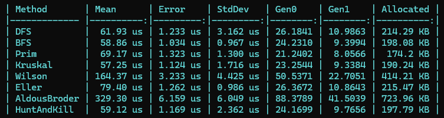
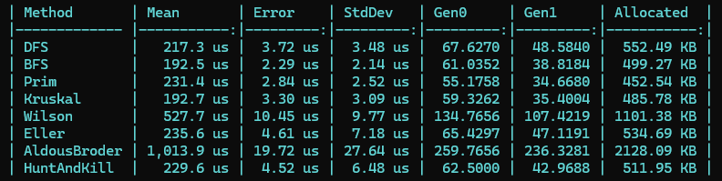
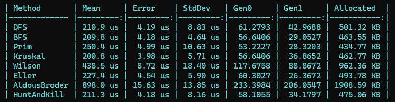
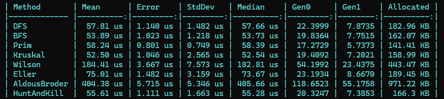
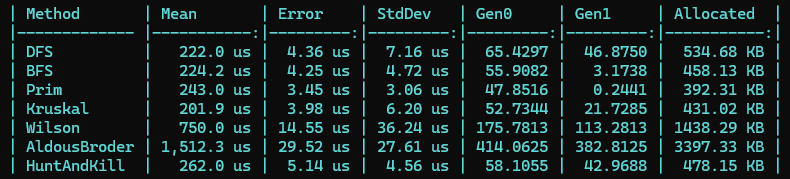
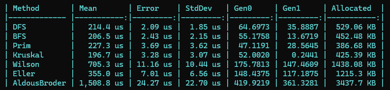

# 各算法生成迷宫的特征及性能对比

## 算法对比

| 算法 | 迷宫特征 | 优点 | 缺点 |
|------|---------|------|-----|
| DFS| 1、长而蜿蜒的通道，分支少且深   2、死胡同通常在通道尽头，形成"河流状"长走廊   3、偏向性高 | 1、内存占用小   2、速度快 | 1、迷宫风格单一   2、长通道多、分支少   3、解法路径可预测性强 |
| BFS | 1、通道短且分支多，呈 放射状扩散   2、从起点到任意顶点的路径接近最短   3、死胡同短而密集 | 1、迷宫分支丰富   2、解法路径短，探索感强 | 1、过于"均匀"，缺乏长通道的趣味性   2、内存开销略大 |
| Prim | 1、从起点均匀向外生长 ，呈"珊瑚状"形态   2、通道长度中等，分支点分布较均匀   3、视觉上像是多个生长中心同时扩展 | 分支和通道长度较均衡 | 1、内存开销较高   2、存在轻微的 中心偏向 |
| Kruskal | 1、全局均匀，没有空间方向偏好   2、通道和分支分布最均匀，死胡同散布各处   3、视觉上呈现"均匀纹理"的迷宫 | 生成的迷宫最"公平"，没有方向偏向 | 1、内存开销较高   2、缺乏长通道的戏剧性 |
| Wilson | 1、没有任何统计偏向，是数学上最"公平"的迷宫   2、通道长度和分支分布完全由概率决定，每次生成差异很大 | 唯一保证均匀分布的算法，理论最优 | 速度不可预测 ，平均时间复杂度较高 |
| Eller | 1、呈现 水平纹理；行内通道较多，行间连接较少   2、有明显的"层状"结构，垂直方向通道稀疏   3、适合矩形迷宫，对非规则形状适应性差 | 1、内存效率极高   2、理论上可生成无限长的迷宫 | 1、只适用于有明确"行"结构的图   2、生成的迷宫有明显的水平偏向，视觉上不够自然 |
| Aldous-Broder | 1、生成均匀   2、没有统计偏向，所有生成树等概率 | 数学保证均匀分布 | 速度最不可控，大迷宫下可能极慢 |

## 性能对比

用 Benchmark 测试不同形状用各种算法生成迷宫的性能

#### 矩形

#### 圆形

#### 蜂窝

#### 三角形

#### 圆三角格

#### 六边形

## 总结

| 算法 | 迷宫风格 | 随机偏差 | 死胡同特征 | 速度 | 内存占用 | 稳定性 |
|------|:-------:|:-------:|:---------:|:---:|:----:|:------:|
| **DFS** | 长通道、少分支 | 强（方向偏好）| 少而深 | ⚡快 | 低 | ✅ 稳定 |
| **BFS** | 短通道、多分支 | 轻（径向偏好）| 多而浅 | ⚡快 | 中 | ✅ 稳定 |
| **Prim** | 珊瑚状生长 | 轻（扩散偏好）| 多而浅 | ⚡快 | 较高 | ✅ 稳定 |
| **Kruskal** | 均匀纹理 | 无 | 均匀 | ⚡快 |	较高 | ✅ 稳定 |
| **Wilson** | 完全随机 | 无（均匀）| 均匀 | 🐢不可预测 | 中 | ❌ 不稳定 |
| **Eller** | 层状结构 | 强（水平偏好）| 中等 | ⚡快 | 极低 | ✅ 稳定 |
| **Aldous-Broder** | 完全随机 | 无（均匀）| 均匀 | 🐢🐢极慢 | 低 | ❌ 极不稳定 |