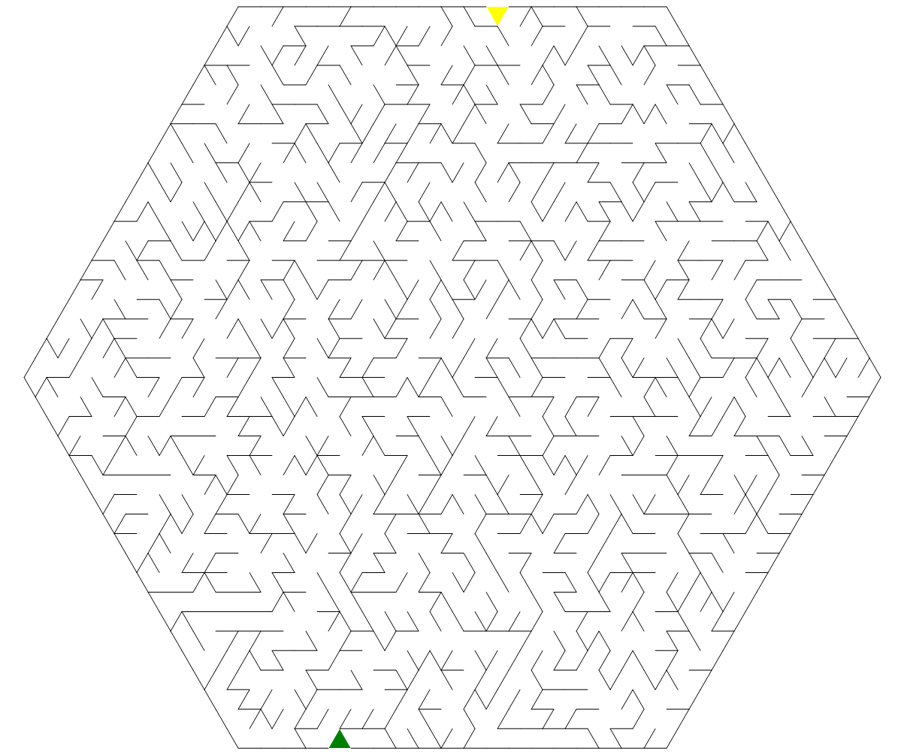

# 六边形迷宫出入口生成器

``` csharp
public class HexagonalMazeGateGenerator
{
    // 生成迷宫出入口
    public MazeGate Generate(HexagonalMazeField field);
}
```

## 参数

- **field** [六边形迷宫生成器](./hexagonal_maze.md)创建的六边形迷宫数据

## 示例

``` csharp
var generator = new HexagonalMazeGateGenerator();
var gate = generator.Generate(field);
```

