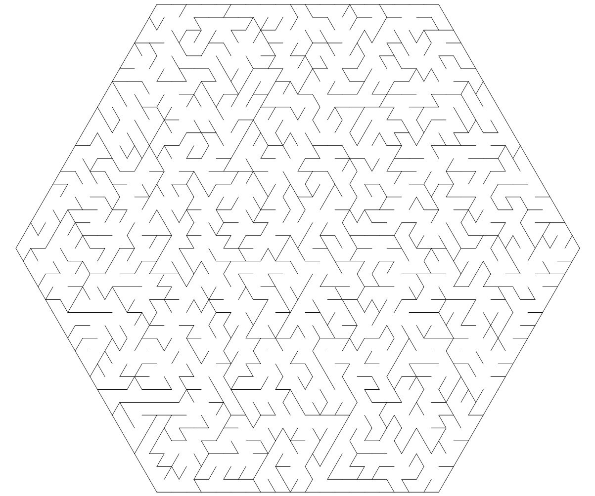

# 矩形迷宫生成器

``` csharp
public class HexagonalMazeGenerator
{
    // 同步函数
    public HexagonalMazeField Generate(int size, 
                                       MazeAlgorithm algorithm = MazeAlgorithm.Prim);
    // 异步函数
    public await Task<HexagonalMazeField> GenerateAsync(int size, 
                                                        MazeAlgorithm algorithm = MazeAlgorithm.Prim);
}
```

## 参数

- **size** 边长
- **algorithm** 生成算法

## 示例

``` csharp
var generator = new HexagonalMazeGenerator();
var field = generator.Generate(size, MazeAlgorithm.Kruskal);
```

