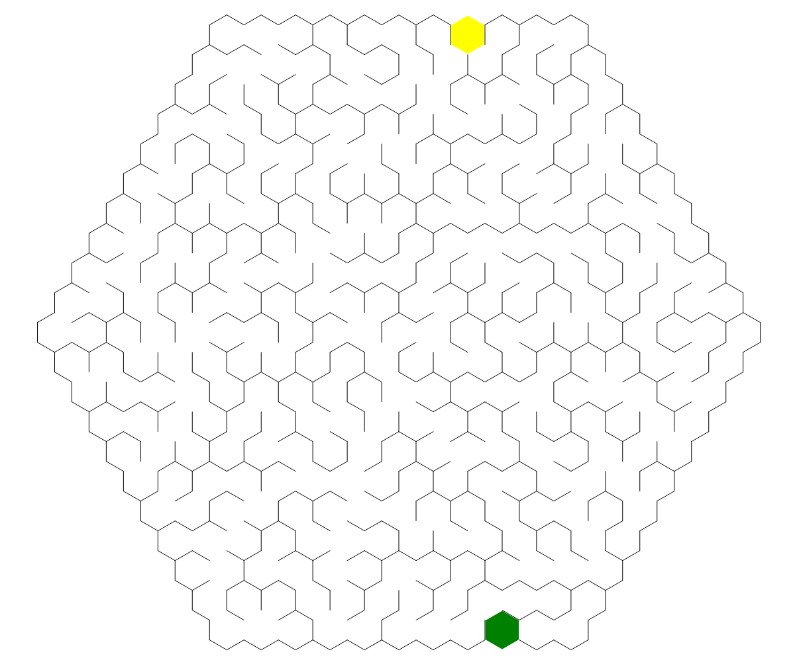

# 蜂窝迷宫出入口生成器

``` csharp
public class HoneycombMazeGateGenerator
{
    // 生成迷宫出入口
    public MazeGate Generate(HoneycombMazeField field);
}
```

## 参数

- **field** [蜂窝迷宫生成器](./honeycomb_maze.md)创建的蜂窝迷宫数据

## 示例

``` csharp
var generator = new HoneycombMazeGateGenerator();
var gate = generator.Generate(field);
```

