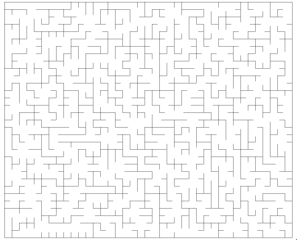

# 随机迷宫生成器

## 矩形迷宫

``` csharp
public class RectangleMaze
```

### 创建迷宫

#### 同步函数

``` csharp
public RectangleField Create(int width, int height, RectangleMazeAlgorithm algorithm = RectangleMazeAlgorithm.Prim)
```

#### 异步函数

``` csharp
public await Task<RectangleField> CreateAsync(int width, int height, RectangleMazeAlgorithm algorithm = RectangleMazeAlgorithm.Prim)
```

#### 参数

- **width**  宽度
- **height** 高度
- **algorithm** 生成算法，提供了三种生成矩形迷宫的算法
    - DFS
    - Prim
    - Kruskal

### 示例

``` csharp
var maze = new RectangleMaze();
maze.Create(width, height, RectangleMazeAlgorithm.Kruskal);
```

> 详细用法和示例请见 [测试工程](https://github.com/simplex86/Maze.Net-Test)

### 效果

