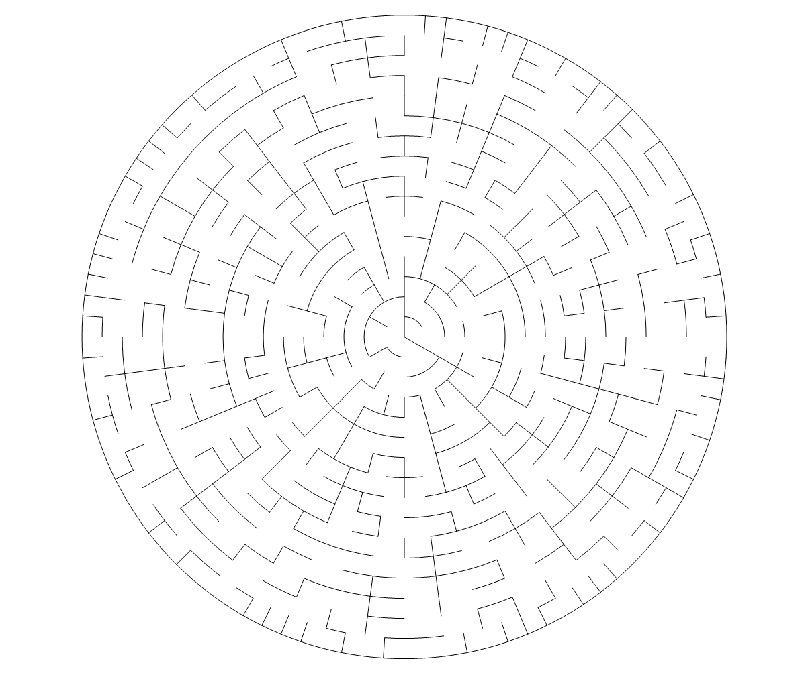

# 圆形迷宫生成器

``` csharp
public class CircularMazeGenerator
{
    // 同步函数
    public CircularMazeField Generate(int rings, 
                                      int sectors, 
                                      MazeAlgorithm algorithm = MazeAlgorithm.DFS, 
                                      SectorStrategy strategy = SectorStrategy.Arc);
    // 异步函数
    public async Task<CircularMazeField> GenerateAsync(int rings, 
                                                       int sectors, 
                                                       MazeAlgorithm algorithm = MazeAlgorithm.DFS, 
                                                       SectorStrategy strategy = SectorStrategy.Arc);
}
```

## 参数

- **rings** 环数
- **sectors** 最大分割数
- **algorithm** 生成算法
    - DFS
    - BFS
    - Prim
    - Kruskal
    - Wilson
    - Eller
    - Aldous-Broder
    - Hunt and Kill
- **strategy** 分割策略
    - Arc 按弧长分割
    - Area 按面积分割

## 示例

``` csharp
var generator = new CircularMazeGenerator();
var field = generator.Generate(rings, sectors, MazeAlgorithm.Kruskal, SectorStrategy.Arc);
```

