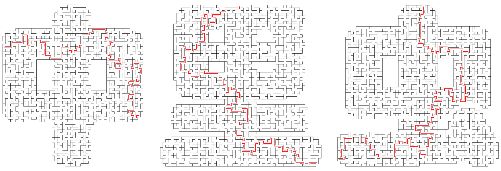

# 自定义迷宫场



## 定义

``` csharp
public class CustomizedMazeField : MazeField
{
    public CustomizedMazeField(CustomizedMazeMask mask);
}
```

## 参数

- **mask** 自定义形状蒙版

## 关联

- [CustomizedMazeMask](./customized_maze_mask.md)
