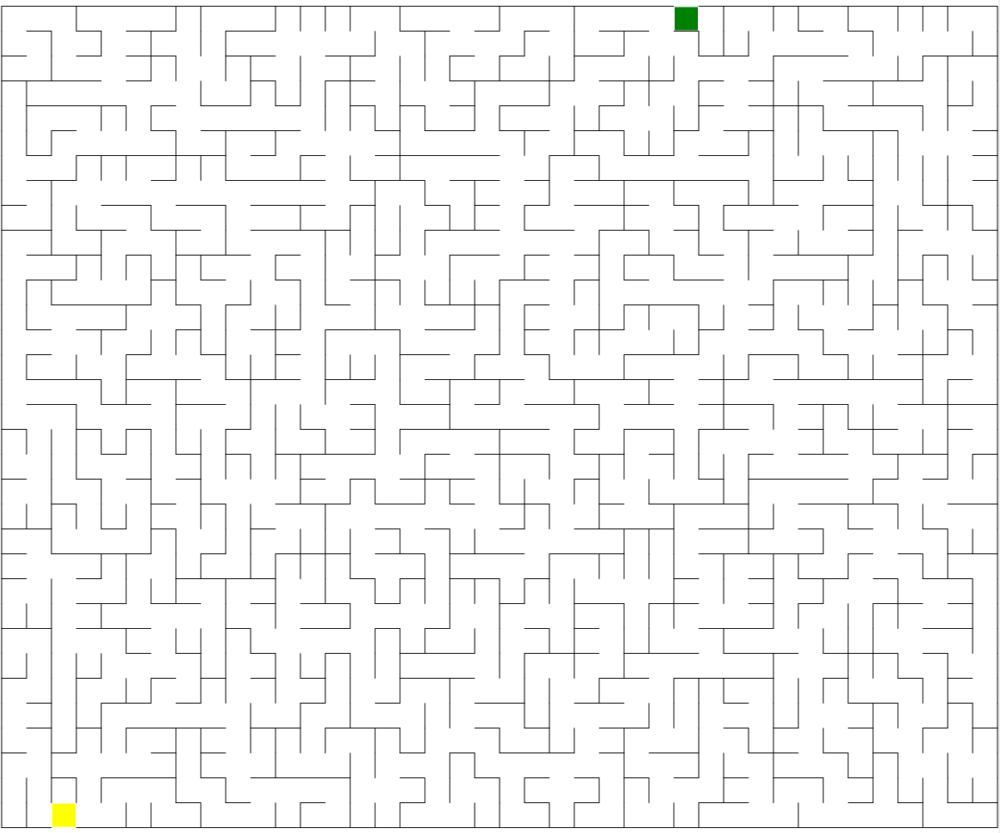

# 矩形迷宫出入口生成器

``` csharp
public class RectangularMazeGateGenerator
{
    // 生成迷宫出入口
    public MazeGate Generate(RectangularMazeField field);
}
```

## 参数

- **field** [矩形迷宫生成器](./retangular_maze.md)创建的矩形迷宫数据

## 示例

``` csharp
var generator = new RectangularMazeGateGenerator();
var gate = generator.Generate(field);
```

