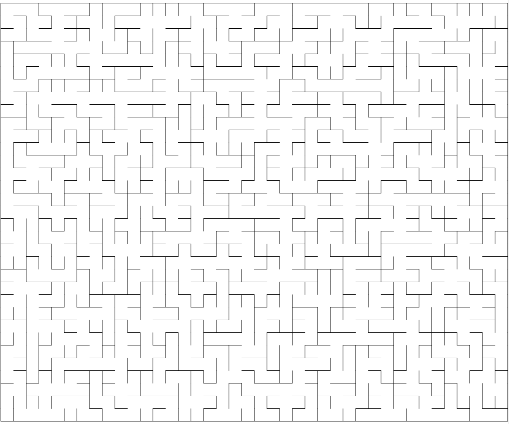

# 矩形迷宫生成器

``` csharp
public class RectangularMazeGenerator
{
    // 同步函数
    public RectangularMazeField Generate(int width, 
                                         int height, 
                                         MazeAlgorithm algorithm = MazeAlgorithm.Prim);
    // 异步函数
    public await Task<RectangularMazeField> GenerateAsync(int width, 
                                                          int height, 
                                                          MazeAlgorithm algorithm = MazeAlgorithm.Prim);
}
```

## 参数

- **width**  宽度
- **height** 高度
- **algorithm** 生成算法
    - DFS
    - BFS
    - Prim
    - Kruskal
    - Wilson
    - Eller
    - Aldous-Broder
    - Hunt and Kill

## 示例

``` csharp
var generator = new RectangularMazeGenerator();
var field = generator.Generate(40, 33, MazeAlgorithm.Kruskal);
```

