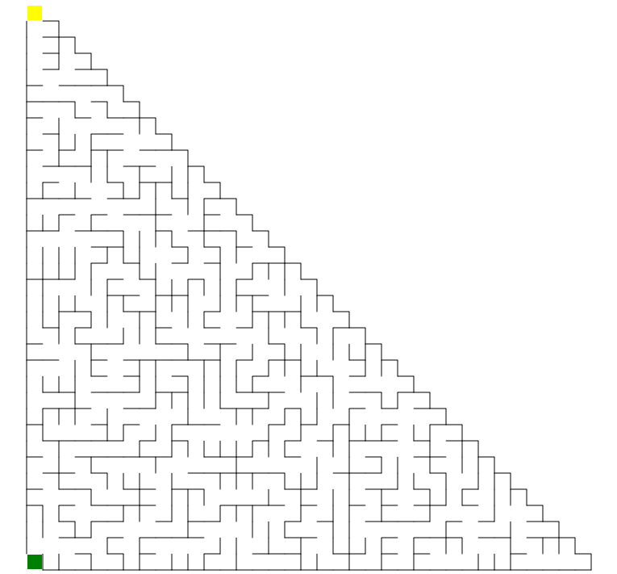

# 阶梯形迷宫出入口生成器

``` csharp
public class StairwayMazeGateGenerator
{
    // 生成迷宫出入口
    public MazeGate Generate(StairwayMazeField field);
}
```

## 参数

- **field** [阶梯形迷宫生成器](./stairway_maze.md)创建的阶梯形迷宫数据

## 示例

``` csharp
var generator = new StairwayMazeGateGenerator();
var gate = generator.Generate(field);
```

