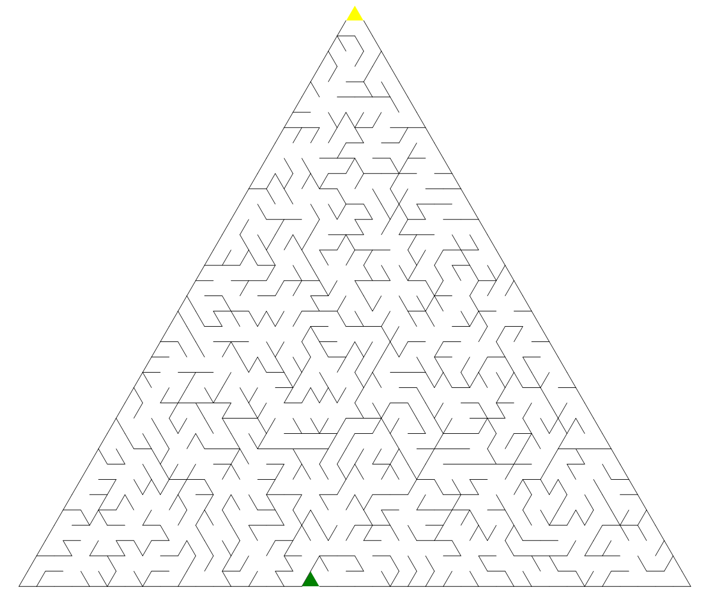

# 三角形迷宫出入口生成器

``` csharp
public class TriangularMazeGateGenerator
{
    // 生成迷宫出入口
    public MazeGate Generate(TriangularMazeField field);
}
```

## 参数

- **field** [三角形迷宫生成器](./triangular_maze.md)创建的三角形迷宫数据

## 示例

``` csharp
var generator = new TriangularMazeGateGenerator();
var gate = generator.Generate(field);
```

