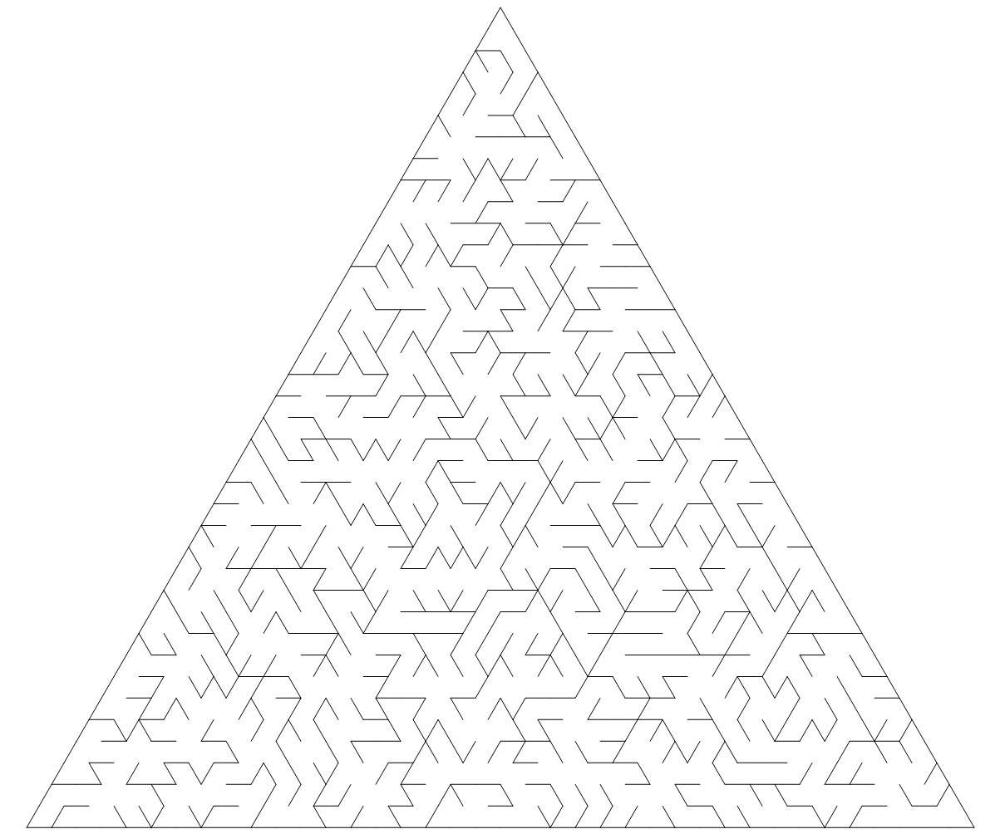

# 三角形迷宫生成器

``` csharp
public class TriangularMazeGenerator
{
    // 同步函数
    public TriangularMazeField Generate(int order,
                                        TriangleOrientation orientation = TriangleOrientation.Upward,
                                        EMazeAlgorithm algorithm = EMazeAlgorithm.Prim);
    // 异步函数
    public async Task<TriangularMazeField> GenerateAsync(int order,
                                                         TriangleOrientation orientation = TriangleOrientation.Upward,
                                                         EMazeAlgorithm algorithm = EMazeAlgorithm.Prim);
}
```

## 参数

- **order** 边长
- **orientation** 朝向
    - Upward 朝上
    - Downward 朝下
- **algorithm** 生成算法
    - DFS
    - BFS
    - Prim
    - Kruskal
    - Wilson
    - Eller
    - Aldous-Broder
    - Hunt and Kill

## 示例

``` csharp
var generator = new TriangularMazeGenerator();
var field = generator.Generate(length, orientation, MazeAlgorithm.Kruskal);
```

