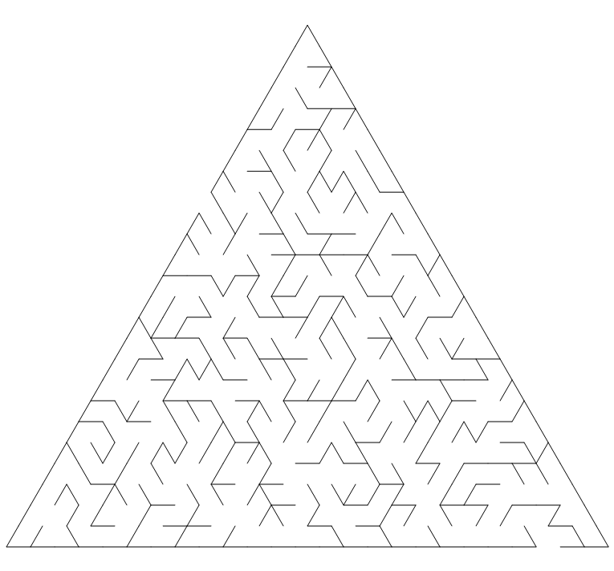

# 三角形迷宫场



## 定义

``` csharp
public class TriangularMazeField : MazeField
{
    public TriangularMazeField(int order, ETriangleOrientation orientation = ETriangleOrientation.Upward);
}
```

## 参数

- **order** 边长
- **orientation** 朝向
    - Upward 朝上
    - Downward 朝下